# MT ZanZhu  枫迹赞助插件~ 🎮💳

[](https://www.oracle.com/java/)
[](https://papermc.io/downloads)
[](LICENSE)
[](https://github.com/YourGitHubName/VMQZanZhu)


一款基于 **V免签** 的零手续费Minecraft赞助插件，支持微信/支付宝支付，无需官方、第三方API！


---

## 📖 目录
- [✨ 特性](#-特性)
- [⚙️ 依赖环境](#️-依赖环境)
- [📦 安装指南](#-安装指南)
- [🔧 配置文件](#-配置文件)
- [🔄 工作流程](#-工作流程)
- [💡 示例场景](#-示例场景)
- [🤝 贡献指南](#-贡献指南)
- [📄 许可证](#-许可证)

---

## ✨ 特性
- ✅ **零手续费** - 基于 V免签系统，绕过官方支付接口
- ✅ **双端支付** - 支持微信/支付宝扫码支付
- ✅ **离线奖励** - 玩家离线时自动暂存奖励，上线后补发
- ✅ **自定义金额** - 支持玩家自定义赞助金额
- ✅ **多项目管理** - 可配置多个赞助项目，每个项目独立奖励
- ✅ **实时回调** - 异步处理支付回调，确保服务器性能

---

## ⚙️ 依赖环境
| 组件              | 适配版本           |
|-------------------|--------------------|
| Java              | JDK 21             |
| Minecraft Server  | Paper 1.21.x       |
| V免签系统          | v1.13+             |

> 📌 确保已正确配置 [V免签PHP版](https://github.com/szvone/vmqphp)

> 📌 由于原作者停止维护已久，原版可能无法正常部署，推荐以下版本（基于原版更新PHP版本的fork分支）

> [V免签修复版](https://github.com/wujingquan/vmqphp)

---

## 📦 安装指南
1. 下载最新版本插件：[Releases](https://github.com/yxc0915/MTZanZhu/releases)
2. 将插件放入服务器 `plugins` 目录
3. 修改配置文件 [`config.yml`](docs/CONFIG.md#基础配置)
4. 重启服务器

```bash
# 首次启动后生成的配置文件结构
plugins/VMQZanZhu/
├── config.yml       # 主配置文件
├── players.yml      # 玩家订单记录
├── history.yml      # 支付历史
└── pending-rewards.yml # 待发放奖励
```

---

## 🔧 配置文件

示例配置片段：
```yaml
vmq:
  domain: "https://your-vmq-domain.com"
  ###你的V免签后台网址
  key: "your-secret-key"
  ###你的V免签通信密钥
  callback:
    port: 8080
    path: "/vmq-callback"
  ###自定义本地回调服务运行端口
  notifyUrl:
  ###如果是内网穿透请在此设置内网穿透后的网址（确保本地端口和回调服务端口一致，TCP协议）

projects:
  vip1:
    name: "基础赞助包"
    amount: 10.00
    rewards:
      - "give %player% diamond 64"
      - "lp user %player% permission set vip true"
```

---

## 🔄 工作流程

```mermaid
sequenceDiagram
  participant 玩家
  participant 插件
  participant V免签系统
  
  玩家->>插件: /openvmq vip1 zfb
  插件->>V免签系统: 创建订单请求
  V免签系统-->>插件: 返回支付链接
  插件->>玩家: 显示支付二维码
  玩家->>V免签系统: 完成支付
  V免签系统->>插件: 回调通知
  插件->>服务器: 执行奖励命令
  插件->>玩家: 发送奖励通知
```


详细流程图：[工作流程详解](docs/WORKFLOW.md)

---

## 💡 示例场景
### 场景1：玩家赞助VIP
1. 玩家输入 `/openvmq vip1 zfb`
2. 生成支付宝付款码，支付¥10.00
3. 支付成功后，玩家自动获得：
   - 64颗钻石
   - VIP权限

### 场景2：自定义金额赞助
1. 玩家输入 `/vmqprice 50 wx`
2. 生成微信付款码，支付¥50.00
3. 服务器广播感谢消息，并给予对应钻石奖励

---

## 🤝 贡献指南
欢迎提交 Pull Request！
遇到问题？[提交 Issue](https://github.com/yxc0915/MTZanZhu/issues)

---

## 📄 许可证
本项目采用 [Apache License](LICENSE) 开源协议
